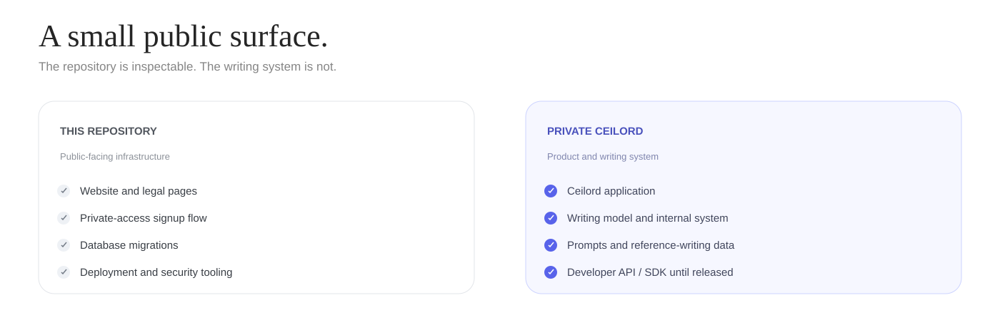
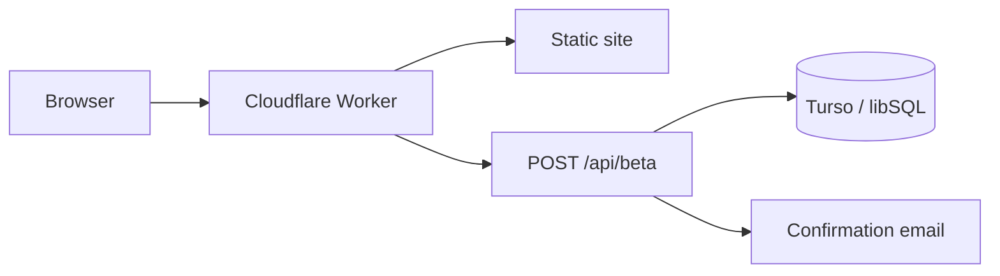

<p align="center">
  
</p>

<p align="center">
  <a href="https://ceilord.com">Website</a> ·
  <a href="https://ceilord.com/#access"><strong>Request private access</strong></a> ·
  <a href="#quick-start">Quick start</a> ·
  <a href="SECURITY.md">Security</a>
</p>

Ceilord is a from-scratch AI writing system focused on producing strong long-form writing from learned human-writing behavior. Give it a topic or brief and it produces the piece itself instead of treating post-generation rewriting or “humanizing” as the product.

**Access is private.** Ceilord is opening the product in small batches through [ceilord.com](https://ceilord.com/#access). The developer API and SDK are planned but are not public yet.

## What Ceilord does

- **Starts from the job.** Give Ceilord the topic, brief, audience, constraints, context, and source material that matter.
- **Produces the long-form piece.** The product is the writing itself, not a second-stage paraphraser or “humanizer.”
- **Treats human writing as the reference domain.** Long-form quality, coherence, factuality, evidence fidelity, variation, and task fit matter independently.

<p align="center">
  
</p>

## What is in this repository?

This repository is the public-facing web and signup layer around Ceilord. It is intentionally small.

| Included here | Kept private |
| --- | --- |
| Website and legal pages | Ceilord application |
| Private-access signup flow | Writing model and internal writing system |
| Cloudflare Worker | Prompts and reference-writing data |
| Turso/libSQL migrations | Production credentials and user data |
| Deployment and security tooling | Developer API / SDK until released |

Cloning this repository lets you run and inspect the website and signup infrastructure. It does **not** run the Ceilord writing system locally.

## Quick start

Requires **Node.js 22+**.

```sh
git clone https://github.com/ceilord/ceilord.git
cd ceilord
npm ci
npm run landing
```

Open `http://127.0.0.1:4770`.

The local preview stores beta requests in `~/.ceilord/beta-signups.jsonl`, so the signup flow works without Cloudflare or Turso credentials.

Run the repository checks with:

```sh
npm run check
```

<details>
<summary><strong>How the public stack works</strong></summary>



- `site/` contains the website, legal pages, styles, and client-side JavaScript.
- `src/worker.ts` serves the site and handles `POST /api/beta`.
- beta requests require explicit consent and retain the accepted notice version.
- duplicate addresses receive the same public response as new addresses, reducing list-probing risk.
- production database credentials live in Cloudflare secrets, never tracked files.

</details>

## Project layout

| Path | Purpose |
| --- | --- |
| `site/` | Public site, blog, legal pages, styles, and scripts |
| `src/worker.ts` | Cloudflare Worker and beta-signup endpoint |
| `src/db.ts` | Database connection helper |
| `src/landingServer.ts` | Local preview server |
| `migrations/` | Public database schema changes |
| `scripts/` | Deployment, migration, vendoring, and security checks |
| `wrangler.jsonc` | Cloudflare Workers configuration |

<details>
<summary><strong>Deployment</strong></summary>

The public site is designed for Cloudflare Workers Static Assets with Turso/libSQL persistence.

Set database credentials as Worker secrets rather than committing them:

```sh
npx wrangler secret put TURSO_DATABASE_URL --env=
npx wrangler secret put TURSO_AUTH_TOKEN --env=
```

`RESEND_API_KEY` is optional and enables confirmation email when configured.

Then migrate the explicitly selected database and deploy:

```sh
set -a; source .dev.vars; set +a
npm run db:migrate
npm run cf:deploy
```

See [CLOUDFLARE.md](CLOUDFLARE.md) for the complete deployment runbook.

</details>

## Security

Do not open public issues for suspected vulnerabilities or exposed credentials. Follow [SECURITY.md](SECURITY.md) for private reporting instructions.

```sh
npm run security:secrets
npm run security:deps
```

## Contributing

Small, focused pull requests are welcome. Read [CONTRIBUTING.md](CONTRIBUTING.md) before opening one.

## License

[MIT](LICENSE). The Ceilord name and logo are not granted for reuse by the software license.
