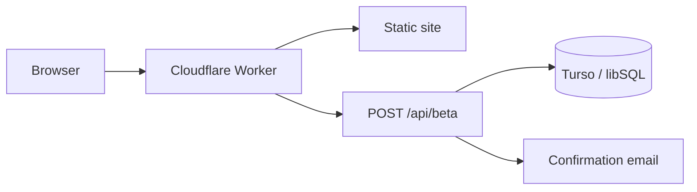

<h1 align="center">Ceilord</h1>

<p align="center"><strong>AI writing for long-form work, built from real human-writing behavior.</strong></p>

<p align="center">
  Ceilord is being built to take a topic or brief and produce the writing itself, not to rewrite or "humanize" a finished AI draft.
</p>

<p align="center">
  <a href="https://github.com/ceilord/ceilord/actions/workflows/ci.yml"></a>
  <a href="LICENSE"></a>
  
  
</p>

<p align="center">
  <a href="https://ceilord.com">Website</a> ·
  <a href="https://ceilord.com#access"><strong>Request private access</strong></a> ·
  <a href="SECURITY.md">Security</a> ·
  <a href="CONTRIBUTING.md">Contributing</a>
</p>

---

## What is Ceilord?

Ceilord is an AI that writes. You tell it what you need, and it writes the finished piece for you.

**Right now it is in private beta.** You have to ask for access first, and it is free during the beta. It will open to everyone later.

**[Ask for access at ceilord.com](https://ceilord.com)**

## Two ways to use it

| | **1. The Ceilord app** | **2. The Ceilord API** |
| --- | --- | --- |
| In plain words | Open the app, type what you need, get your writing | Your own app asks Ceilord to write for it |
| Made for | Students and anyone who wants to write | Developers building their own product |
| Your data | Kept by Ceilord | Kept in **your own private database** |
| Who does the writing | Ceilord | **Ceilord** |
| Cost | A monthly subscription | An API key from Ceilord |
| Can you use it today? | Private beta, ask for access | **Not yet.** Planned |

## The one rule you must know

> **Your database can be yours. The writing always comes from Ceilord.**
>
> The Ceilord writing model is not open source. It never runs on your computer. If you build your own app with your own database, your app still has to call the Ceilord API, so you always need a Ceilord API key.

```text
   THE APP                                  THE API

   Student                                  Your app  ---- your own database
      |                                        |            (private, yours)
      v                                        |
   Ceilord app                                 |  API key
      |                                        |
      +------------------+---------------------+
                         v
                   Ceilord API
                         |
                         v
                Ceilord writing model
              (private, run by Ceilord)
```

## What is inside this repository?

This repository is only the **website and the sign-up code**. It is not the writing model.

| In this repository | Not in this repository |
| --- | --- |
| The Ceilord website | The writing model |
| The "get private access" sign-up | Its prompts and training writing |
| Setup and deploy scripts | The Ceilord app |
| Database migrations | API keys and billing |

If you clone this repository today, you can run and inspect the public site and the sign-up code. You cannot run the Ceilord writing model from it. Code to talk to the Ceilord API will be added here once the API is ready.

## Quick start

Requires **Node.js 22 or newer**.

```sh
git clone https://github.com/ceilord/ceilord.git
cd ceilord
npm ci
npm run landing
```

Open `http://127.0.0.1:4770`.

The local preview keeps beta requests in `~/.ceilord/beta-signups.jsonl`, so the signup flow works without a Cloudflare or Turso account.

Run the repository checks with:

```sh
npm run check
```

## How the public stack works



The public stack is deliberately small:

- `site/` contains the static website, legal pages, styles, and client-side JavaScript.
- `src/worker.ts` serves the site and handles `POST /api/beta`.
- beta requests require explicit consent and are stored with the accepted notice version.
- duplicate addresses receive the same public response as new addresses, reducing list-probing risk.
- production database credentials live in Cloudflare secrets, never in tracked files.

## Project layout

| Path | Purpose |
| --- | --- |
| `site/` | Public site, blog, legal pages, styles, and scripts |
| `src/worker.ts` | Cloudflare Worker and beta-signup endpoint |
| `src/db.ts` | Database connection helper |
| `src/landingServer.ts` | Local preview server |
| `migrations/` | Public database schema changes |
| `scripts/` | Deployment, migration, vendoring, and security checks |
| `wrangler.jsonc` | Cloudflare Workers configuration |

## Deploying your own copy

The public site and signup Worker are designed for Cloudflare Workers Static Assets with Turso/libSQL persistence.

Set secrets through Wrangler rather than committing them:

```sh
npx wrangler secret put TURSO_DATABASE_URL --env=
npx wrangler secret put TURSO_AUTH_TOKEN --env=
```

`RESEND_API_KEY` is optional and enables the confirmation email when configured.

Then migrate the explicitly selected database and deploy:

```sh
set -a; source .dev.vars; set +a
npm run db:migrate
npm run cf:deploy
```

See [CLOUDFLARE.md](CLOUDFLARE.md) for environment-specific setup and deployment guards.

## Security

Do not open public issues for suspected vulnerabilities or exposed credentials. Follow [SECURITY.md](SECURITY.md) for private reporting instructions.

The repository includes checks for secret leakage and production dependency issues:

```sh
npm run security:secrets
npm run security:deps
```

## Contributing

Small, focused pull requests are welcome. Read [CONTRIBUTING.md](CONTRIBUTING.md) before opening one.

## License

[MIT](LICENSE). The Ceilord name and logo are not granted for reuse by the software license.
