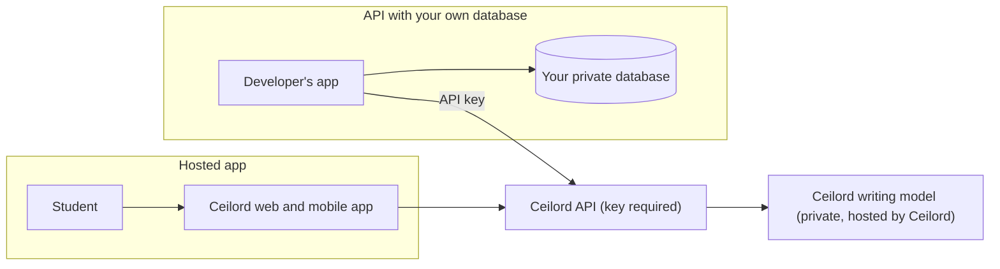
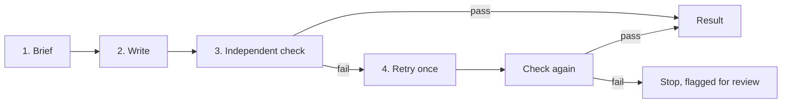

<h1 align="center">Ceilord</h1>

<p align="center"><strong>An AI writing system built to learn from how real people write.</strong></p>

<p align="center">
  <a href="https://github.com/ceilord/ceilord/actions/workflows/ci.yml"></a>
  <a href="LICENSE"></a>
  
  
</p>

<p align="center">
  <a href="https://ceilord.com">Website</a> ·
  <a href="CLOUDFLARE.md">Deploy</a> ·
  <a href="SECURITY.md">Security</a> ·
  <a href="CONTRIBUTING.md">Contributing</a>
</p>

## Ceilord in one minute

| | |
| --- | --- |
| **What it is** | An AI writing engine. You give it a topic or a brief, and it writes the finished piece. It is not a rewriting or "humanizing" tool. |
| **How it differs from a blank chat** | In a chat you carry the brief, the misses and the final check. Ceilord runs that loop: it writes, checks the result with a separate model call, retries once, then returns the piece or stops. |
| **Status** | **Private beta.** Access opens in small batches. The beta is free, no card. It will open to everyone later. |
| **How to get in** | **[Request private access at ceilord.com](https://ceilord.com)** |

## Where each part stands today

| Part | Who it is for | Status |
| --- | --- | --- |
| **Hosted app** (web and mobile) | Students and anyone who wants finished writing | Private beta, request access |
| **Ceilord API and SDK** | Developers who build their own product on Ceilord | **Planned, not live yet** |
| **This repository** (open core) | Anyone who wants to read or run the public site and signup code | Available now, MIT license |

## Which one do I use?

| If you are... | Use | What you need |
| --- | --- | --- |
| A student or writer who wants a finished piece | The hosted app | Request private access, then a subscription once the beta ends |
| A developer building your own app, for example for SAT students | The Ceilord API with your own database | Request private access, then a Ceilord API key |
| Curious how the site and signup work | This repository | Nothing. Clone it and run it |

## Hosted app vs API with your own database

| | **Hosted app** | **API with your own database** |
| --- | --- | --- |
| Interface | Ceilord web and mobile app | Your own app |
| Where your data lives | Ceilord manages it | **Your database, self-hosted and private** |
| Where the writing model runs | Ceilord | **Ceilord. Always.** |
| What you pay | A subscription in the app | An API key from Ceilord |
| Needs the Ceilord API | Built in | **Yes, required** |
| Available | Private beta | Planned |

> **Read this part twice.** Self-hosting your database does **not** mean self-hosting the writing model. The model is not open source and never runs on your machine. Every self-hosted setup calls the Ceilord API, so you need a Ceilord API key. Without a key, this repository writes nothing.



## How a Ceilord job works today



The check is a separate model call that uses explicit criteria from your brief: every instruction addressed, topic matched, length respected, no placeholder text. If the retry still fails, Ceilord stops instead of silently passing.

## Roadmap

| Stage | What opens | Status |
| --- | --- | --- |
| Now | Hosted app in private beta, request access | In progress |
| Next | Ceilord API and SDK for developers | Planned |
| Later | Open to everyone | Planned, no date |

## Common questions

| Question | Answer |
| --- | --- |
| Is the API live? | No. Direct product access is the current beta. API and SDK access are planned. |
| Is Ceilord a rewriting or humanizer tool? | No. It writes the piece itself from your brief. |
| Can I run the model myself? | No. The model is not open source. |
| Do I need an API key for a self-hosted setup? | Yes. Your database is yours, but writing always goes through the Ceilord API. |
| Is it free? | The private beta is free, no card. The hosted app will be a subscription. API pricing is not announced yet. |
| How do I get access? | [Request it at ceilord.com](https://ceilord.com). Access opens in small batches. |

## What this repository is

This is the **open core**: the public parts of Ceilord that anyone can read, run, and adapt.

| In this repo | Not in this repo |
| --- | --- |
| The public site and early-access page (`site/`) | The writing model and its prompts |
| The signup Worker and consent handling (`src/worker.ts`) | Training and reference writing data |
| Database migrations (`migrations/`) | The hosted web and mobile apps |
| Deployment and security scripts (`scripts/`) | API keys, billing, and account systems |

The client libraries and examples for the API will live here once it opens to developers.

## How this repository's code fits together

```text
Browser ──> Cloudflare Worker (static site + /api/beta) ──> Turso database
                     │
                     └──> Resend (one-time confirmation email)
```

- The site in `site/` is static HTML, CSS, and a little JavaScript, served by Cloudflare Workers Static Assets.
- `POST /api/beta` validates the email, requires explicit consent, rate limits per IP, and stores the request with the version of the notice that was accepted.
- Duplicate emails get the same response as new ones, so the list can't be probed.
- New addresses get a short confirmation email from `hello@ceilord.com`.

## Quick start

Requires Node 22 or newer.

```sh
git clone https://github.com/ceilord/ceilord.git
cd ceilord
npm ci
npm run landing      # static site on http://127.0.0.1:4770
npm run check        # typecheck
```

`npm run landing` stores signups in a local file (`~/.ceilord/beta-signups.jsonl`), so you can try the form without any cloud account.

## Deploy your own copy

The Worker and site deploy to Cloudflare with the pinned Wrangler CLI.

```sh
npx wrangler secret put TURSO_DATABASE_URL --env=
npx wrangler secret put TURSO_AUTH_TOKEN --env=
npx wrangler secret put RESEND_API_KEY --env=
DATABASE_URL=... npm run db:migrate
npm run cf:deploy
```

Full steps, environments, and the deploy guard are in [CLOUDFLARE.md](CLOUDFLARE.md). Never commit credentials; `npm run security:secrets` scans the Git history for them.

## Project layout

| Path | What it is |
| --- | --- |
| `site/` | Public site, legal pages, styles, and scripts |
| `src/worker.ts` | Early-access API (validation, consent, rate limit, email) |
| `src/db.ts` | Database connection helper |
| `src/landingServer.ts` | Local preview server |
| `migrations/` | SQL schema changes |
| `scripts/` | Deploy checks, migrations, secret scan |
| `wrangler.jsonc` | Cloudflare configuration for production, dev, and staging |

## Security

Report vulnerabilities privately as described in [SECURITY.md](SECURITY.md). Please do not open public issues for security problems.

## Contributing

Small, focused pull requests are welcome. Read [CONTRIBUTING.md](CONTRIBUTING.md) first.

## License

[MIT](LICENSE). The Ceilord name and logo are not covered by the license.
