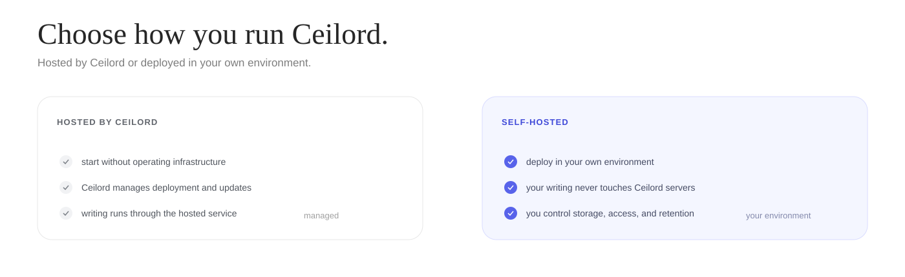
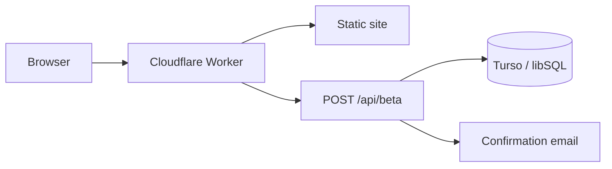

<p align="center">
  
</p>

<p align="center">
  <a href="https://ceilord.com">Website</a> ·
  <a href="https://ceilord.com/#access"><strong>Request hosted access</strong></a> ·
  <a href="#quick-start">Quick start</a> ·
  <a href="SECURITY.md">Security</a>
</p>

<p align="center"><strong>Hosted beta.</strong> Access opens in small batches.</p>

<p align="center">
  
</p>

<p align="center"><strong><a href="https://ceilord.com/#access">Request hosted access →</a></strong></p>

## Hosted or self-hosted

Use Ceilord as a managed hosted service or deploy it in your own environment.

<p align="center">
  
</p>

| | Hosted by Ceilord | Self-hosted |
| --- | --- | --- |
| Deployment | Ceilord-operated | Your environment |
| Operations | Managed by Ceilord | Managed by your team |
| Writing path | Through Ceilord's hosted service | **Your writing never touches Ceilord servers** |
| Storage / logs | Service-managed | Controlled by your deployment |
| Model provider | Managed by Ceilord | Called directly from your deployment with its credentials |
| Availability | Hosted beta, access opens in batches | Self-hosted beta, access opens in batches |

**Self-hosted privacy:** **your writing never touches Ceilord servers.** The engine runs in your environment and calls Anthropic directly using your deployment's credentials. Anthropic's data handling still applies.

## This repository

This repository currently contains the Ceilord website, access signup flow, Cloudflare Worker, database migrations, and deployment/security tooling. The self-hosted beta distribution is opening separately in batches and is not included in this repository yet.

## Quick start

Requires **Node.js 22+**.

```sh
git clone https://github.com/ceilord/ceilord.git
cd ceilord
npm ci
npm run landing
```

Open `http://127.0.0.1:4770`.

The local preview stores beta requests in `~/.ceilord/beta-signups.jsonl`, so the signup flow works without Cloudflare or Turso credentials.

Run the repository checks with:

```sh
npm run check
```

<details>
<summary><strong>How the public stack works</strong></summary>



- `site/` contains the website, legal pages, styles, and client-side JavaScript.
- `src/worker.ts` serves the site and handles `POST /api/beta`.
- beta requests require explicit consent and retain the accepted notice version.
- duplicate addresses receive the same public response as new addresses, reducing list-probing risk.
- production database credentials live in Cloudflare secrets, never tracked files.

</details>

## Project layout

| Path | Purpose |
| --- | --- |
| `site/` | Public site, blog, legal pages, styles, and scripts |
| `src/worker.ts` | Cloudflare Worker and beta-signup endpoint |
| `src/db.ts` | Database connection helper |
| `src/landingServer.ts` | Local preview server |
| `migrations/` | Public database schema changes |
| `scripts/` | Deployment, migration, vendoring, and security checks |
| `wrangler.jsonc` | Cloudflare Workers configuration |

<details>
<summary><strong>Deployment</strong></summary>

The public site is designed for Cloudflare Workers Static Assets with Turso/libSQL persistence.

Set database credentials as Worker secrets rather than committing them:

```sh
npx wrangler secret put TURSO_DATABASE_URL --env=
npx wrangler secret put TURSO_AUTH_TOKEN --env=
```

`RESEND_API_KEY` is optional and enables confirmation email when configured.

Then migrate the explicitly selected database and deploy:

```sh
set -a; source .dev.vars; set +a
npm run db:migrate
npm run cf:deploy
```

See [CLOUDFLARE.md](CLOUDFLARE.md) for the complete deployment runbook.

</details>

## Security

Do not open public issues for suspected vulnerabilities or exposed credentials. Follow [SECURITY.md](SECURITY.md) for private reporting instructions.

```sh
npm run security:secrets
npm run security:deps
```

## Contributing

Small, focused pull requests are welcome. Read [CONTRIBUTING.md](CONTRIBUTING.md) before opening one.

## License

[MIT](LICENSE). The Ceilord name and logo are not granted for reuse by the software license.
